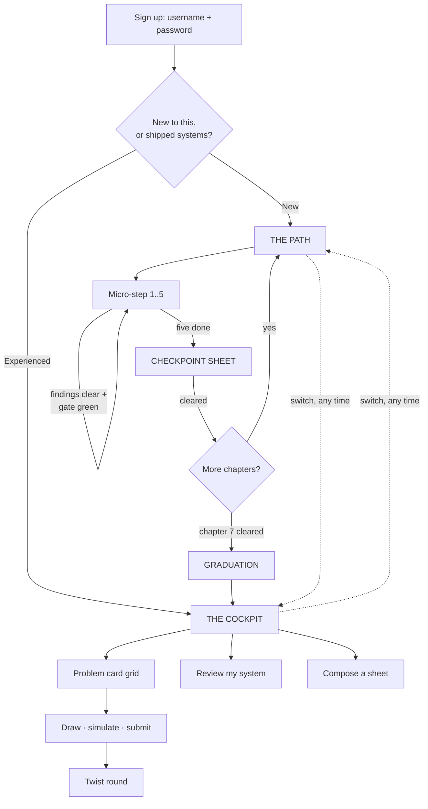
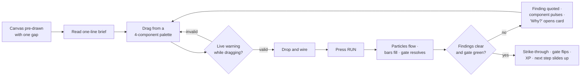

# 03 — Flows

## The whole system

## Entry

Signup is username and password. No email, nothing to verify. Then **one** question, full
screen, two large choices, no third option and no "skip":

> **Where are you starting from?**
> — *I'm new to this* → the Path
> — *I've shipped systems* → the Cockpit

Reversible from the header at any time. A single line under the choice removes the stakes:
*"Either way you can switch whenever you like."*

## The Path

One vertical spine. Seven chapters. Each chapter: five micro-steps and one checkpoint.

There is no navigation, no sidebar, no menu. The spine *is* the beginner interface, and
"what should I do next" is answered by the one glowing node.

## The micro-step loop — the core of the product

This runs 35 times before graduation. It has to be right.

Properties that matter:

1. **Never blank.** The canvas always arrives with a working system that has one hole. A
   beginner is never asked "what would you build?" — only "what is missing here?"
2. **Failure costs nothing.** No score, no lives, no penalty. A failed run says *not yet* and
   quotes the finding. The learner can run again immediately.
3. **The verdict is instant and free.** Local arithmetic. No spinner, no token cost, no key.
4. **The palette is 4 components, not 108.** Locked ones stay visible and dimmed, labelled
   with the chapter that opens them — so the learner can see the world is bigger.
5. **The budget is always on screen.** It is the tension in every step.

## The checkpoint

The real product with the training wheels still on, 15–20 minutes:

- A genuine level-1 problem brief, full text.
- The request flow is **pre-declared** — a beginner has no concept of a flow, and this is the
  single most likely place the ladder dies.
- Palette still cut, to the chapter's components plus everything already learned.
- Hints available but not shown.
- A real load scenario with a real gate.

Clearing it unlocks the next chapter **and** the matching level in the full problem bank —
so the ladder is continuously handing over territory in the real product.

## Graduation

Fires once, when chapter 7's checkpoint clears. Full-bleed, no chrome.

Two canvases side by side: what they just drew, and the same problem *unscaffolded* with the
full 108-component palette visible. One line: **"You just did this."** One button: *Open the
full bank*.

This is the moment a learner becomes a user. It is the highest-leverage screen in the product
and the one the original memo never considered.

## The cockpit

Advanced home. The brief is "**complex problems, made easy to approach**" — not simplified
problems, but problems whose *relevance* is obvious at a glance.

Three regions:

1. **Due strip** (top). Concepts gone stale on the spaced-repetition clock, as chips, with
   one button: *Start today's drill*. It generates a problem around the three most overdue.
2. **The bank** (main). A card grid, grouped by level. Every card answers "why this one?"
   before it is clicked: domain, three concept chips, best score, twist status.
3. **The rail** (right). Radar over eight concept groups, and a dense heatmap of all 45
   concepts. Framed as *what to attack next*, never as a report card.

Plus two promoted entry points that are currently buried and are the likeliest revenue:
**Review my system** and **Compose a sheet**.

## Switching between depths

A persistent, quiet control in the header — not a settings page. An advanced user can drop
onto the Path out of curiosity; a struggling learner can look at the full bank without
losing their place. Neither direction resets anything.
