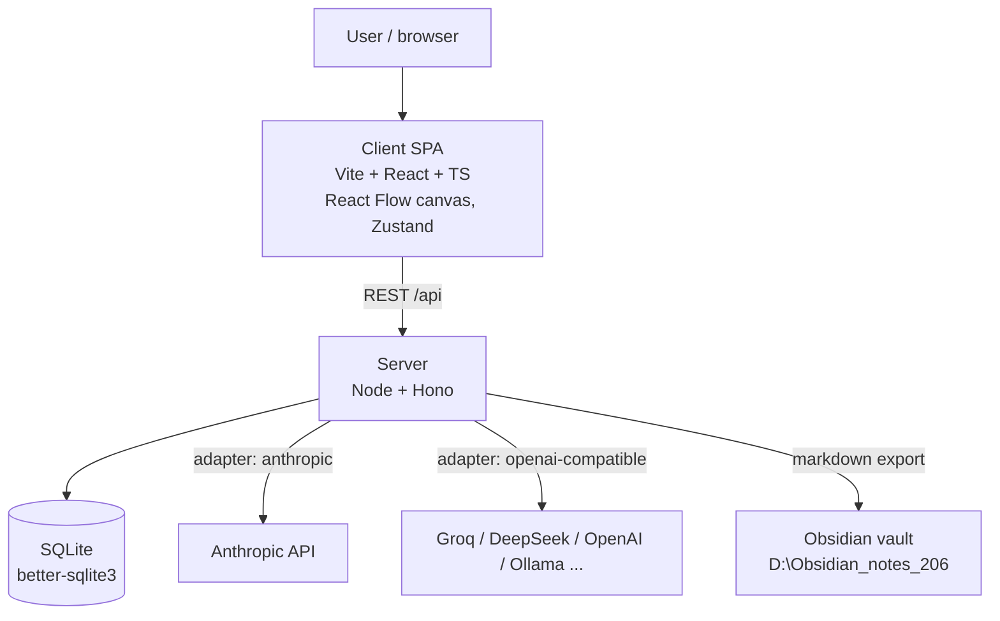

# Loadbearing — design spec

**Date:** 2026-07-30
**Status:** Approved direction ("propose a solution then start development"); hybrid canvas, pluggable LLM providers, local persistence chosen by the user.

## Purpose

A local web app for learning software/AI-system architecture by doing: the app poses a
design problem, the user draws a solution on a canvas using predefined architecture
components, and an LLM grades the design like a rigorous interviewer — per-dimension
scores, named failure modes, Socratic follow-ups, a "twist" round under changed
constraints, and long-term per-concept mastery tracking.

Success criteria:
- Full loop works end-to-end locally: pick problem → draw → submit → structured score →
  twist → mastery updated.
- Scoring is deep enough to name concrete failures ("payment retry without idempotency
  → double charge"), not generic praise.
- Covers advanced ground: consistency models, sharding, backpressure, idempotency,
  outbox/saga, multi-region, cost/overengineering, and AI-system patterns (RAG, agents,
  eval gates, prompt-injection defense).
- Any LLM provider can be parked in: Anthropic native or anything OpenAI-compatible
  (Groq, DeepSeek, OpenAI, OpenRouter, Ollama).

## Architecture (C4 container view)



Why this shape: keys must not live in the browser (CORS + secret hygiene), mastery data
must survive months (SQLite file), and the whole thing must start with one command. A
desktop wrapper (Tauri/Electron) was rejected as overengineering; a pure SPA was rejected
because browser→LLM calls are CORS-blocked for several target providers.

## Repository layout

```
loadbearing/
  package.json          # npm workspaces: client, server; `npm run dev` runs both
  client/               # Vite React TS
    src/
      canvas/           # React Flow: nodes, edges, palette, freeform layer
      panels/           # problem panel, feedback panel, settings, dashboard
      state/            # Zustand stores
      lib/              # graph serialization, api client
  server/
    src/
      index.ts          # Hono app
      db.ts             # SQLite schema + migrations
      llm/              # provider adapters + JSON-repair
      scoring/          # prompt builders, rubric, score parsing
      problems/         # seed bank JSON + generation
  data/                 # loadbearing.sqlite (gitignored)
  docs/superpowers/specs/
```

## Components

### 1. Semantic canvas (client/canvas)

- React Flow (`@xyflow/react`) with a left palette of typed components, drag-to-place.
  Node types (~25): client, mobile_client, cdn, dns, load_balancer, api_gateway,
  service, monolith, serverless_fn, cache, sql_db, nosql_db, blob_store, search_index,
  queue, stream, worker, scheduler, rate_limiter, websocket_gw, third_party, llm,
  vector_db, embedding_svc, eval_gate, observability, auth.
- Each node: editable label + free-text annotation (e.g. "idempotency key = order_id",
  "read replica x3"). Annotations are first-class — they carry the reasoning the LLM
  grades.
- Typed edges: `sync` (solid), `async` (dashed), `replication` (dotted); optional label
  (protocol, payload). Edge type picked via toolbar or right-click.
- Freeform layer (hybrid requirement): sticky-note nodes (free text, yellow) and a
  freehand pen overlay (SVG strokes on a layer above/below React Flow). Strokes are
  visual-only; sticky notes ARE sent to the LLM as annotations.
- Undo/redo (zustand temporal or manual stack), delete, multi-select, zoom/pan,
  fit-view. Autosave draft to localStorage per problem (crash safety); explicit
  submit snapshots to SQLite. NOTE from the Brain: [[Dual-write full-canvas saves
  destroy data]] — the draft save is single-writer (debounced, last-write-wins on one
  key per problem), never merged from two sources.

### 2. Graph DSL (client/lib, shared shape)

Serialized on submit:

```json
{
  "nodes": [{ "id": "n1", "type": "load_balancer", "label": "ALB", "annotation": "round-robin, health checks" }],
  "edges": [{ "from": "n1", "to": "n2", "kind": "sync", "label": "HTTP/JSON" }],
  "stickies": [{ "text": "cache-aside; TTL 60s; stampede: request coalescing" }]
}
```

Positions are stored for re-loading the drawing but stripped from the LLM payload
(irrelevant tokens).

### 3. Problem engine (server/problems)

Problem schema:

```json
{
  "id": "l3-flash-sale",
  "title": "Flash-sale checkout",
  "level": 3,
  "domain": "e-commerce",
  "prompt": "Design checkout for a 10k-RPS flash sale...",
  "functional": ["reserve stock", "charge card", "confirm order"],
  "nonFunctional": { "peakRps": 10000, "p99Ms": 500, "dataSize": "50M SKUs" },
  "constraints": ["team of 4", "cloud budget $3k/mo"],
  "concepts": ["idempotency", "queue-backpressure", "inventory-consistency", "rate-limiting"],
  "rubricHints": "Watch for: double-charge on retry, oversell without atomic reserve...",
  "twists": ["Payment provider now has 2s p99 and 1% timeout rate. Adapt."]
}
```

- Seed bank: ~25 problems, levels L1–L6:
  - L1 fundamentals: caching a read-heavy API, static site + uploads
  - L2 scaling basics: URL shortener at scale, news feed reads
  - L3 reliability: flash-sale checkout, webhook delivery system
  - L4 data-intensive: analytics pipeline, chat system, notification fanout
  - L5 distributed hard-mode: multi-region active-active, exactly-once billing,
    cell-based isolation
  - L6 AI systems: RAG platform with eval gates, agent orchestration with tool
    sandboxing, LLM cost-control gateway
- `concepts` values come from a fixed taxonomy (~40 concepts) so mastery tracking keys
  are stable.
- LLM problem generation: "generate L{n} problem targeting concepts X,Y" → validated
  against the schema, saved to SQLite as a custom problem.

### 4. LLM adapter (server/llm)

- `settings` table stores: provider (`anthropic` | `openai-compatible`), baseUrl, model,
  apiKey. Settings UI in client; key never returns to the client after save (masked).
- One internal call shape: `complete(system, user, jsonSchemaHint) → parsed JSON`.
  - anthropic adapter → `POST /v1/messages`.
  - openai-compatible adapter → `POST {baseUrl}/chat/completions`.
- JSON robustness: strip code fences, attempt parse, on failure one repair round-trip
  ("return ONLY valid JSON matching..."), then hard error surfaced in UI with raw text.
- Errors (bad key, rate limit, timeout 60s) → typed error to client, shown with fix hint.

### 5. Scoring engine (server/scoring)

Prompt = grader persona (staff-engineer interviewer, honest, specific) + problem +
rubric concepts + graph DSL + scoring schema. Output:

```json
{
  "overall": 72,
  "dimensions": {
    "requirements": { "score": 8, "max": 10, "notes": "..." },
    "scalability": { "score": 7, "max": 10, "notes": "..." },
    "reliability": { "score": 5, "max": 10, "notes": "..." },
    "data_consistency": { "score": 6, "max": 10, "notes": "..." },
    "security": { "score": 7, "max": 10, "notes": "..." },
    "cost_simplicity": { "score": 8, "max": 10, "notes": "penalize overengineering" }
  },
  "critical_failures": [{ "title": "Double charge on retry", "detail": "...", "concept": "idempotency", "severity": "high" }],
  "spofs": ["single Redis, no replica"],
  "missing": ["no rate limiter at edge"],
  "good_calls": ["outbox pattern between order svc and queue"],
  "socratic_questions": ["What happens to in-flight orders when the queue consumer crashes mid-batch?"],
  "concept_scores": { "idempotency": 0.3, "queue-backpressure": 0.8 },
  "model_answer_summary": "...",
  "verdict_teaching": [{ "component": "...", "why": "...", "breaks_without": "...", "rejected_alt": "..." }]
}
```

- Twist round: after feedback, one twist from the problem (or LLM-generated) is applied;
  user edits the SAME canvas; resubmit is scored on the delta ("did they address the
  twist?") plus full rubric. One twist per attempt (YAGNI; more rounds later).
- Overengineering is explicitly scored — matching the architecture-advisor red flags
  (microservices for a team of 2, K8s for one container...).

### 6. Mastery + dashboard (server/db + client/panels)

SQLite schema:

```sql
attempts(id, problem_id, round, graph_json, score_json, overall, created_at)
mastery(concept PRIMARY KEY, ema_score REAL, attempts INT, last_seen TEXT)
problems_custom(id, json, created_at)
settings(key PRIMARY KEY, value)
```

- Mastery update: exponential moving average per concept
  (`ema = 0.7*old + 0.3*new`), from `concept_scores`.
- Dashboard: radar of 8 concept groups, per-concept heatmap, attempt history with score
  trend, streak counter.
- "Train weakness": picks/generates a problem weighted toward lowest-EMA concepts.
- Obsidian export (button per attempt): markdown post-mortem (problem, final score,
  critical failures, what I learned) written to
  `D:\Obsidian_notes_206\Notes\Loadbearing\` — append-only, new file per attempt,
  respecting Brain hard rules.

## Error handling

- LLM unreachable/invalid key → banner with provider-specific hint; attempt kept as
  draft, resubmit allowed.
- Malformed LLM JSON after repair → show raw response in a details pane; never crash.
- SQLite is single-user local; WAL mode; all writes in transactions.
- Canvas drafts autosaved to localStorage (debounced 1s) keyed by problem id.

## Testing

- Vitest on server: graph DSL validation, prompt builder snapshot, JSON-repair unit
  tests, mastery EMA math, adapter request shaping (mocked fetch).
- Client: lightweight — serialization round-trip tests; manual browser verification of
  canvas UX (per run skill) since canvas interactions are visual.
- One fake-LLM integration test: server with `FAKE_LLM=1` returns canned score → full
  submit path exercised without a key.

## Out of scope (v1)

Multi-user, auth, cloud sync, collaborative editing, image export of canvas, mobile,
voice, timed exam mode, importing real Excalidraw files.
